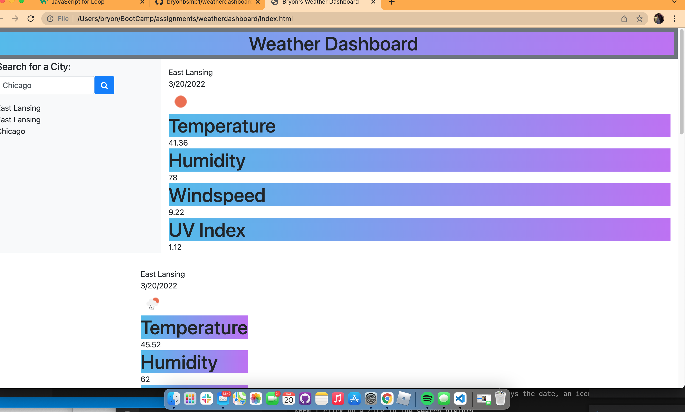

# Weather Dashboard

Homework 6

# Screenshot of the app 

 

# Technologies used:

HTML, Script.js, CSS, Open Weather API's

# Overview
This app is for looking up the weather for a particular city and giving out a five-day forecast and the current weather.

# License
MIT
 
# Contact Info
https://github.com/bryonbsmb1